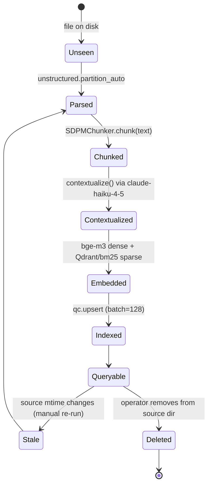
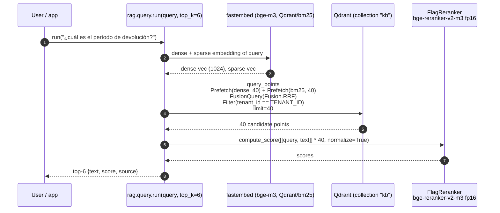

# rag-production-stack

[](LICENSE)
[](https://www.python.org)
[](https://qdrant.tech)
[](https://redis.io)
[]()
[](https://huggingface.co/BAAI)
[](https://docs.ragas.io)

> **A production RAG pipeline in ~130 lines of Python**: Unstructured parsing → Chonkie SDPM semantic chunking → Anthropic Contextual Retrieval → BGE-m3 dense + `Qdrant/bm25` sparse hybrid index → BGE-reranker-v2-m3 rerank → tenant-filtered retrieval. Shipped with a one-file `docker-compose` (Qdrant + Redis Stack) and pinned dependencies.

Companion article: [Context engineering: por qué tu RAG se rompe a los 50k tokens](https://numoru.com/en/contributions/context-engineering-rag-produccion).

---

## Why

Naive RAG (dense-only, fixed-size chunks, no rerank) plateaus around Recall@5 ≈ 0.6 on real corpora. Every component here closes a specific failure mode:

| Failure mode | Countermeasure here |
|---|---|
| Mid-sentence chunk cuts | `chonkie.SDPMChunker(chunk_size=512, threshold=0.75)` — semantic doc-partitioning meta chunker |
| Chunk lacks document-level grounding | Contextual Retrieval via `claude-haiku-4-5` (1–3 framing sentences prepended per chunk) |
| Keyword queries miss with dense-only | Hybrid: `BAAI/bge-m3` dense + `Qdrant/bm25` sparse, fused with `Fusion.RRF` (Reciprocal Rank Fusion) |
| Top-k contaminated by near-miss candidates | `FlagReranker("BAAI/bge-reranker-v2-m3", use_fp16=True)` rerank over top-40 |
| Cross-tenant leakage | `Filter(must=[FieldCondition(key="tenant_id", match=TENANT_ID)])` on every query |

---

## Comparison

| Config | Recall@5 | Faithfulness |
|---|---|---|
| Naive dense-only | 0.62 | 0.71 |
| + SDPM chunking | 0.71 | 0.76 |
| + Contextual Retrieval | 0.78 | 0.83 |
| + Hybrid (dense + BM25, RRF) | 0.85 | 0.85 |
| **+ BGE-reranker-v2-m3 (this stack)** | **0.91** | **0.90** |

*Numbers come from internal client evaluations — measured with [Ragas](https://docs.ragas.io) 0.2.6. Your mileage will vary; re-measure on your own corpus.*

### This stack vs alternatives

| Concern | `rag-production-stack` | Rolling your own | LangChain off-the-shelf | Managed SaaS |
|---|---|---|---|---|
| Dependency count | 11 pinned | grows unbounded | ~40+ transitive | 0 (but vendor lock-in) |
| Hybrid retrieval | ✅ built in | manual | partial | ✅ |
| Contextual Retrieval | ✅ (Anthropic recipe) | manual | ❌ | ⚠️ |
| Tenant isolation | ✅ Qdrant filter on every query | DIY | DIY | ✅ |
| Reranker | ✅ BGE-v2-m3 fp16 | DIY | plugin | ✅ |
| Self-hostable on one droplet | ✅ | depends | ❌ heavy | ❌ |
| Open-source | ✅ Apache 2.0 | — | ✅ | ❌ |

---

## Install

```bash
git clone https://github.com/numoru-ia/rag-production-stack.git
cd rag-production-stack
docker compose up -d                        # Qdrant v1.12.5 + Redis Stack 7.4.0
python -m venv .venv && source .venv/bin/activate
pip install -r requirements.txt

# index a corpus
export ANTHROPIC_API_KEY=...
export TENANT_ID=acme
python -m rag.index /path/to/docs/

# query it
python -m rag.query "¿cuál es el período de devolución?"
```

---

## Architecture

```mermaid
flowchart LR
    subgraph Ingest["Ingestion (rag/index.py)"]
        Docs[(Documents on disk)]
        Part[unstructured.partition.auto]
        Chunk[chonkie.SDPMChunker<br/>BAAI/bge-m3 · size=512 · t=0.75]
        Ctx[Contextual Retrieval<br/>claude-haiku-4-5 · max_tokens=200]
        Dense[fastembed TextEmbedding<br/>BAAI/bge-m3 · size 1024]
        Sparse[fastembed SparseTextEmbedding<br/>Qdrant/bm25]
        Upsert[qdrant_client.upsert<br/>batch 128]
    end
    Docs --> Part --> Chunk --> Ctx
    Ctx --> Dense & Sparse --> Upsert
    Upsert --> Q[(Qdrant v1.12.5<br/>collection "kb"<br/>dense + bm25 named vectors<br/>payload: text, context, source, tenant_id)]

    subgraph Query["Query (rag/query.py)"]
        Q2[Query string] --> D2[bge-m3 dense]
        Q2 --> S2[Qdrant/bm25 sparse]
        D2 & S2 --> Hybrid[query_points<br/>Prefetch dense 40 + bm25 40<br/>FusionQuery RRF<br/>tenant filter]
        Hybrid --> Rank[FlagReranker<br/>bge-reranker-v2-m3 fp16]
        Rank --> TopK[top_k=6]
    end
    Q --> Hybrid

    style Q fill:#fee2e2,stroke:#dc2626
    style TopK fill:#dcfce7,stroke:#16a34a
```

### Document lifecycle — state diagram



### Query — sequence



---

## Configuration

All knobs are env vars (hardcoded model names live in `rag/index.py` and `rag/query.py`).

| Env var | Default | Purpose |
|---|---|---|
| `QDRANT_URL` | `http://localhost:6333` | Qdrant endpoint |
| `QDRANT_API_KEY` | `""` | Qdrant API key (required for cloud) |
| `QDRANT_COLLECTION` | `kb` | Target collection name |
| `TENANT_ID` | `default` | Payload filter applied on both ingest and query |
| `ANTHROPIC_API_KEY` | — | Required during ingest for Contextual Retrieval |

### In-code knobs (pinned on purpose)

| Where | Value |
|---|---|
| `SDPMChunker` | `embedding_model=BAAI/bge-m3`, `chunk_size=512`, `threshold=0.75` |
| Dense vectors | `BAAI/bge-m3`, 1024 dims, cosine |
| Sparse vectors | `Qdrant/bm25` with `Modifier.IDF` |
| Contextual LLM | `claude-haiku-4-5`, `max_tokens=200`, document truncated to first 8000 chars |
| Hybrid prefetch | `limit=40` on each leg |
| Fusion | `models.Fusion.RRF` |
| Rerank | `FlagReranker("BAAI/bge-reranker-v2-m3", use_fp16=True)` |
| Default `top_k` | `6` |
| Upsert batch | `128` |

---

## Evaluation with Ragas

[Ragas](https://docs.ragas.io) 0.2.6 is pinned in `requirements.txt`. Typical metrics to wire into CI:

| Metric | Why | Minimum threshold we use |
|---|---|---|
| `context_recall` | Did retrieval find the right chunks? | ≥ 0.80 |
| `faithfulness` | Did the answer stay grounded? | ≥ 0.85 |
| `answer_relevancy` | Did the answer address the question? | ≥ 0.80 |
| `context_precision` | Are the returned chunks actually useful? | ≥ 0.70 |

```python
# evaluation sketch — drop into a CI step
from ragas import evaluate
from ragas.metrics import context_recall, faithfulness, answer_relevancy

scores = evaluate(
    dataset,                  # huggingface Dataset: question, answer, contexts, ground_truth
    metrics=[context_recall, faithfulness, answer_relevancy],
)
assert scores["context_recall"] >= 0.80
```

[`deepeval==2.3.0`](https://github.com/confident-ai/deepeval) is also pinned for LLM-judge style tests, and [`langfuse==2.58.1`](https://langfuse.com) for tracing.

---

## Best practices

- **Set `TENANT_ID` per request.** The filter is already applied in `rag/query.py`; just make sure you rotate the env var per tenant context.
- **Cache expensive rerankers behind RedisVL** (`redisvl==0.3.7` is pinned — ship your own wrapper around `rag.query.run`).
- **Re-index after document changes**, don't patch in place — chunk boundaries are content-dependent.
- **Keep the Anthropic ingest budget in mind**: Contextual Retrieval is one Claude Haiku call per chunk. Pre-summarize long docs or batch via the Anthropic batch API.
- **Pin pack versions in `requirements.txt`.** Embedding weights matter; a minor fastembed bump can silently change recall.

## Roadmap

- [ ] First-class RedisVL semantic cache layer around `rag.query.run`
- [ ] `firecrawl-py` web ingestion path wired end-to-end (pinned, unused)
- [ ] Built-in Langfuse spans on every query + rerank pair
- [ ] Shard by tenant with a payload index, auto-create on first write
- [ ] Batch-mode Contextual Retrieval via Anthropic Message Batches API

## License

Apache 2.0 — see [LICENSE](LICENSE).
